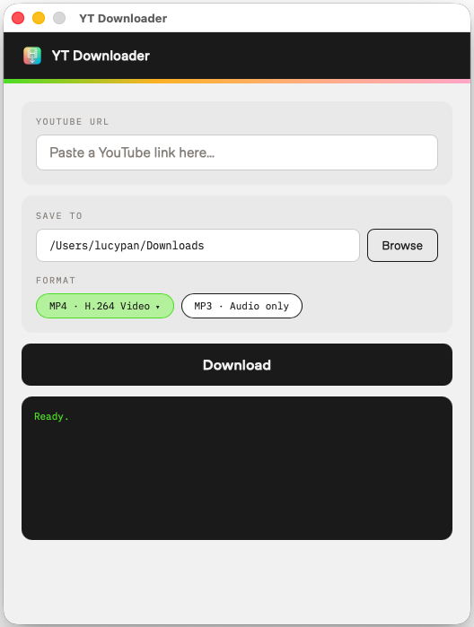

# YT Downloader

A clean macOS desktop app to download YouTube videos. A minimal wrapper around yt-dlp with a native Swift UI — no Python, no Homebrew, no setup.

Landing page: https://ytdownloader-minimal.vercel.app/



## Features

- Save as MP4 (H.264 or H.265) or MP3 audio
- yt-dlp and ffmpeg bundled — nothing to install
- macOS 13+

## Install

### Option 1 — Download the DMG

[Download latest release](https://github.com/lucyfang/yt-downloader/releases/latest)

On first launch, macOS will block the app. Go to **System Settings → Privacy & Security** and click **Open Anyway**.

### Option 2 — Build from source

Paste this into Terminal:

```bash
curl -fsSL https://ytdownloader-minimal.vercel.app/build.sh | bash
```

Downloads the source, compiles it, and installs the app automatically. Requires Xcode Command Line Tools — the script will prompt to install them if missing.

## Project structure

```
ytdownloader/
├── app/
│   ├── YTDownloader.swift   ← entire app in one file
│   ├── AppIcon.icns
│   └── bin/
│       ├── yt-dlp           ← bundled (not committed, download separately)
│       └── ffmpeg           ← bundled universal binary (not committed)
└── web/
    ├── index.html           ← landing page (deployed to Vercel)
    ├── build.sh             ← one-liner build + install script
    ├── install.sh           ← DMG install script
    ├── favicon.png / .ico
    └── vercel.json
```

## Tech

- Pure Swift — `Cocoa` + `WebKit` (WKWebView)
- JS ↔ Swift bridge via `window.webkit.messageHandlers.bridge.postMessage()`
- yt-dlp and ffmpeg run as subprocesses, stdout streamed live to the UI
- Prefs saved to `~/.ytdownloader_prefs.json`
